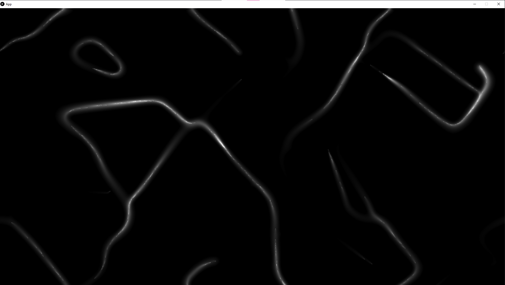

# PHYSARUM SIMULATOR

[link to website (not mine btw)](https://cargocollective.com/sagejenson/physarum)

## Installation

This project uses the Processing Library to render graphics. Although this library is designed for novices to learn how to code, its very basic graphical capabilities allowed me to prototype this
project quickly. The render loop in the code takes ~500 ms on my device, so it should be switched to a shader langauge in the future. This is why I only render one out of every twenety timesteps. 

Here is the [link](https://processing.org/) to the Processing Library to download. This project has been tested with Java Processing version 3.5.4.

Afterwards, add the core java archive file to your referecened libraries in your java runtime.

## Simulation results

This simulation is multithreaded, which allows for a update tick to take ~4 ms (as compared to ~25 ms when single-threaded). Below is a picture of the simulation.

## Credit

All code is completely written by myself. I would like to acknoledge the Physarum project ([link](https://cargocollective.com/sagejenson/physarum)) for the project inspiration and guidelines.
